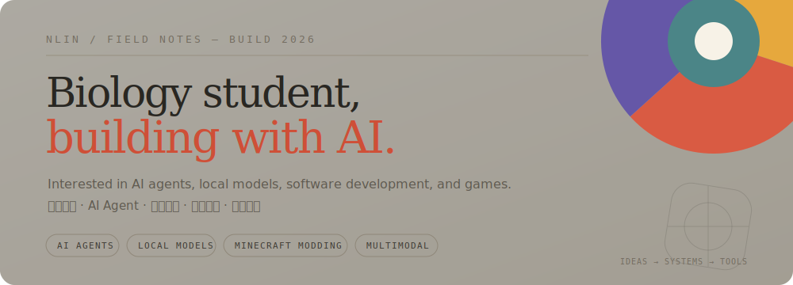

<p align="center">
  
</p>

## Hi, I’m nlin 👋

I build AI workspaces, local-first tools, and playful game systems. I enjoy moving between models, interfaces, and mechanics—then turning the interesting parts into software people can actually use.

你好，我是 nlin。我喜欢在 AI 模型、软件界面与游戏机制之间来回探索，并把其中有趣的想法做成真正可用的项目。

`AI agents` · `Local models` · `Multimodal AI` · `Minecraft modding` · `Creative software`

---

## Selected Works / 代表项目

<table>
  <tr>
    <td width="50%" valign="top">
      <sup>01 / AGENT SYSTEMS</sup><br><br>
      <strong><a href="https://github.com/zenghaolinz/ultra-studio">Ultra Studio →</a></strong><br>
      <sub>A general-purpose agent workspace for conversations, memory, image generation, and 3D asset workflows.</sub><br><br>
      <sub>通用 AI Agent 工作台，覆盖对话、记忆、图像生成与 3D 资产工作流。</sub><br><br>
      <code>React</code> <code>Rust</code> <code>Python</code>
    </td>
    <td width="50%" valign="top">
      <sup>02 / LEARNING TOOLS</sup><br><br>
      <strong><a href="https://github.com/zenghaolinz/quiz-studio">Quiz Studio →</a></strong><br>
      <sub>A local-first question bank with OCR imports, AI explanations, custom exams, and assisted grading.</sub><br><br>
      <sub>本地优先的智能题库，支持 OCR 导入、AI 解析、自定义试卷与辅助评分。</sub><br><br>
      <code>Tauri</code> <code>TypeScript</code> <code>SQLite</code>
    </td>
  </tr>
  <tr>
    <td width="50%" valign="top">
      <sup>03 / GAME SYSTEMS</sup><br><br>
      <strong><a href="https://github.com/zenghaolinz/Minecraft-mod-speedforce">Speed Force Mod →</a></strong><br>
      <sub>A NeoForge experiment in speed levels, lightning trails, bullet time, phasing, and time remnants.</sub><br><br>
      <sub>围绕速度等级、闪电拖尾、子弹时间、穿墙与时间残影展开的 NeoForge 模组实验。</sub><br><br>
      <code>Java</code> <code>NeoForge 1.21.1</code>
    </td>
    <td width="50%" valign="top">
      <sup>04 / CREATIVE AI</sup><br><br>
      <strong><a href="https://github.com/zenghaolinz/CanvasDesignStudio">Canvas Design Studio →</a></strong><br>
      <sub>A local AI image generation and editing workspace built around embedded ComfyUI workflows.</sub><br><br>
      <sub>围绕 ComfyUI 工作流构建的本地图像生成与编辑工作台。</sub><br><br>
      <code>React</code> <code>FastAPI</code> <code>ComfyUI</code>
    </td>
  </tr>
</table>

---

## Interests / 兴趣坐标

**AI Agents · Local LLMs · Open Source**  
**Minecraft Modding · Game Development**  
**Multimodal AI · Creative Software · Biology**

我对“模型如何成为工具”以及“机制如何创造体验”尤其感兴趣。对我来说，AI、游戏开发和生物学并不是互相隔离的领域，而是理解复杂系统的不同入口。

I am especially interested in how models become tools and how mechanics create experiences. AI, game development, and biology feel less like separate subjects and more like different ways to study complex systems.

---

## Currently Exploring / 最近在探索

- **Consumer-hardware inference** — running useful AI models without data-center hardware  
  **消费级硬件推理** — 让实用模型在普通设备上稳定运行
- **Reliable agent behavior** — building agents that are observable, recoverable, and less fragile  
  **更可靠的 Agent** — 可观察、可恢复，并减少脆弱的自动化链路
- **Minecraft mechanics** — experimenting with time, movement, and emergent gameplay  
  **Minecraft 机制** — 探索时间、移动与涌现式玩法
- **Lightweight desktop AI** — local-first creative and learning applications  
  **轻量桌面 AI** — 本地优先的创作与学习软件

---

## Toolbox / 技术栈

```text
Languages    C / C++ · Python · JavaScript / TypeScript · Rust · Java
Desktop      Tauri · React · Vite · FastAPI
AI           Local LLMs · OpenAI-compatible APIs · ComfyUI · OCR
Game         Minecraft NeoForge · gameplay systems · visual effects
Principles   local-first · usable prototypes · open source · keep exploring
```

<p align="center">
  <sub><a href="https://github.com/zenghaolinz">github.com/zenghaolinz</a> · ideas → systems → tools</sub>
</p>
